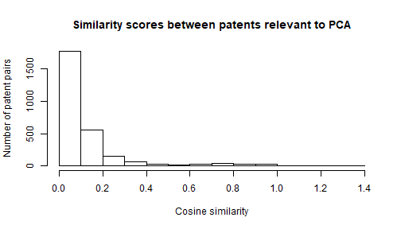

The following is a brief foray into patent citation networks. The analysis is done on 3 patents that describe patent citation analysis (PCA) themselves. 

The first step is to download the relevant data from the PatentsView API. We can use the CPC code of  [Y10S707/933](https://worldwide.espacenet.com/classification#!/CPC=Y10S707/933) to identify the patents that relate to PCA. 


```r
library(patentsview)
library(dplyr)
library(visNetwork)
library(magrittr)
library(stringr)
library(knitr)
library(webshot2)

# Write a query to pull patents assigned to the CPC code of "Y10S707/933"

# ** the api currently throws a 500 error when searching by CPC codes
# query <- qry_funs$contains(cpc_current.cpc_subgroup_id = "Y10S707:933")

# for now we'll pretend it worked
pat_nums <- c("10095778","9075849","8818996","8504560","8131701","7966328","7797336","7716226","7523126","6499026","6339767")

# we have to go against the patent_citiation endpoint now, these fields are no longer available from the patent endpoint
# can we _or the two queries or does that blend the results? ie do we need a cited by query
# and a separate citing query?

# probably could do combined query and have two dplyrs to pull out citing and cited patents
# one looking for patent_number in pat_nums and one looking for cited patent_number in pat_nums 
combined_query <- qry_funs$or(
   qry_funs$eq(patent_number = pat_nums),
   qry_funs$eq(cited_patent_number = pat_nums)
)

citing_query = qry_funs$eq(patent_number = pat_nums)
cited_query = qry_funs$eq(cited_patent_number = pat_nums)

# mutate results here to mimic the return of the original version of the api??
# or can we deal with the new structure directly?

# old structure was
# "patents": [ { "patent_number": "10095778","cited_patents": [{"cited_patent_number": "4991087",...}],
#                                            "citedby_patents": [{"citedby_patent_number": "10635705"}],{...}]

# new structure
# "patent_citations": [ {"patent_number": "10095778", "cited_patent_number": "6430539"} ... ]


# Create a list of fields to pull from the API
fields <- c(
  "patent_number", 
  "cited_patent_number"
)

# use a post?  the q: parameter is pretty big
# Send a request to the API
res <- search_pv(citing_query, fields = fields, all_pages = TRUE, endpoint = "patent_citations", method = "GET")
#> [1] "https://search.patentsview.org/api/v1/patent_citation/?q=%7B%22_or%22%3A%5B%7B%22_eq%22%3A%7B%22patent_number%22%3A%2210095778%22%7D%7D%2C%7B%22_eq%22%3A%7B%22patent_number%22%3A%229075849%22%7D%7D%2C%7B%22_eq%22%3A%7B%22patent_number%22%3A%228818996%22%7D%7D%2C%7B%22_eq%22%3A%7B%22patent_number%22%3A%228504560%22%7D%7D%2C%7B%22_eq%22%3A%7B%22patent_number%22%3A%228131701%22%7D%7D%2C%7B%22_eq%22%3A%7B%22patent_number%22%3A%227966328%22%7D%7D%2C%7B%22_eq%22%3A%7B%22patent_number%22%3A%227797336%22%7D%7D%2C%7B%22_eq%22%3A%7B%22patent_number%22%3A%227716226%22%7D%7D%2C%7B%22_eq%22%3A%7B%22patent_number%22%3A%227523126%22%7D%7D%2C%7B%22_eq%22%3A%7B%22patent_number%22%3A%226499026%22%7D%7D%2C%7B%22_eq%22%3A%7B%22patent_number%22%3A%226339767%22%7D%7D%5D%7D&f=[\"patent_number\",\"cited_patent_number\"]&o={\"offset\":0,\"size\":1000}&s="
#> [1] "https://search.patentsview.org/api/v1/patent_citation/?q=%7B%22_or%22%3A%5B%7B%22_eq%22%3A%7B%22patent_number%22%3A%2210095778%22%7D%7D%2C%7B%22_eq%22%3A%7B%22patent_number%22%3A%229075849%22%7D%7D%2C%7B%22_eq%22%3A%7B%22patent_number%22%3A%228818996%22%7D%7D%2C%7B%22_eq%22%3A%7B%22patent_number%22%3A%228504560%22%7D%7D%2C%7B%22_eq%22%3A%7B%22patent_number%22%3A%228131701%22%7D%7D%2C%7B%22_eq%22%3A%7B%22patent_number%22%3A%227966328%22%7D%7D%2C%7B%22_eq%22%3A%7B%22patent_number%22%3A%227797336%22%7D%7D%2C%7B%22_eq%22%3A%7B%22patent_number%22%3A%227716226%22%7D%7D%2C%7B%22_eq%22%3A%7B%22patent_number%22%3A%227523126%22%7D%7D%2C%7B%22_eq%22%3A%7B%22patent_number%22%3A%226499026%22%7D%7D%2C%7B%22_eq%22%3A%7B%22patent_number%22%3A%226339767%22%7D%7D%5D%7D&f=[\"patent_number\",\"cited_patent_number\"]&o={\"offset\":0,\"size\":1000}&s="
#> [1] "https://search.patentsview.org/api/v1/patent_citation/?q=%7B%22_or%22%3A%5B%7B%22_eq%22%3A%7B%22patent_number%22%3A%2210095778%22%7D%7D%2C%7B%22_eq%22%3A%7B%22patent_number%22%3A%229075849%22%7D%7D%2C%7B%22_eq%22%3A%7B%22patent_number%22%3A%228818996%22%7D%7D%2C%7B%22_eq%22%3A%7B%22patent_number%22%3A%228504560%22%7D%7D%2C%7B%22_eq%22%3A%7B%22patent_number%22%3A%228131701%22%7D%7D%2C%7B%22_eq%22%3A%7B%22patent_number%22%3A%227966328%22%7D%7D%2C%7B%22_eq%22%3A%7B%22patent_number%22%3A%227797336%22%7D%7D%2C%7B%22_eq%22%3A%7B%22patent_number%22%3A%227716226%22%7D%7D%2C%7B%22_eq%22%3A%7B%22patent_number%22%3A%227523126%22%7D%7D%2C%7B%22_eq%22%3A%7B%22patent_number%22%3A%226499026%22%7D%7D%2C%7B%22_eq%22%3A%7B%22patent_number%22%3A%226339767%22%7D%7D%5D%7D&f=[\"patent_number\",\"cited_patent_number\"]&o={\"offset\":1000,\"size\":1000}&s="
res2 <- search_pv(cited_query , fields = fields, all_pages = TRUE, endpoint = "patent_citations", method = "GET")
#> [1] "https://search.patentsview.org/api/v1/patent_citation/?q=%7B%22_or%22%3A%5B%7B%22_eq%22%3A%7B%22cited_patent_number%22%3A%2210095778%22%7D%7D%2C%7B%22_eq%22%3A%7B%22cited_patent_number%22%3A%229075849%22%7D%7D%2C%7B%22_eq%22%3A%7B%22cited_patent_number%22%3A%228818996%22%7D%7D%2C%7B%22_eq%22%3A%7B%22cited_patent_number%22%3A%228504560%22%7D%7D%2C%7B%22_eq%22%3A%7B%22cited_patent_number%22%3A%228131701%22%7D%7D%2C%7B%22_eq%22%3A%7B%22cited_patent_number%22%3A%227966328%22%7D%7D%2C%7B%22_eq%22%3A%7B%22cited_patent_number%22%3A%227797336%22%7D%7D%2C%7B%22_eq%22%3A%7B%22cited_patent_number%22%3A%227716226%22%7D%7D%2C%7B%22_eq%22%3A%7B%22cited_patent_number%22%3A%227523126%22%7D%7D%2C%7B%22_eq%22%3A%7B%22cited_patent_number%22%3A%226499026%22%7D%7D%2C%7B%22_eq%22%3A%7B%22cited_patent_number%22%3A%226339767%22%7D%7D%5D%7D&f=[\"patent_number\",\"cited_patent_number\"]&o={\"offset\":0,\"size\":1000}&s="
#> [1] "https://search.patentsview.org/api/v1/patent_citation/?q=%7B%22_or%22%3A%5B%7B%22_eq%22%3A%7B%22cited_patent_number%22%3A%2210095778%22%7D%7D%2C%7B%22_eq%22%3A%7B%22cited_patent_number%22%3A%229075849%22%7D%7D%2C%7B%22_eq%22%3A%7B%22cited_patent_number%22%3A%228818996%22%7D%7D%2C%7B%22_eq%22%3A%7B%22cited_patent_number%22%3A%228504560%22%7D%7D%2C%7B%22_eq%22%3A%7B%22cited_patent_number%22%3A%228131701%22%7D%7D%2C%7B%22_eq%22%3A%7B%22cited_patent_number%22%3A%227966328%22%7D%7D%2C%7B%22_eq%22%3A%7B%22cited_patent_number%22%3A%227797336%22%7D%7D%2C%7B%22_eq%22%3A%7B%22cited_patent_number%22%3A%227716226%22%7D%7D%2C%7B%22_eq%22%3A%7B%22cited_patent_number%22%3A%227523126%22%7D%7D%2C%7B%22_eq%22%3A%7B%22cited_patent_number%22%3A%226499026%22%7D%7D%2C%7B%22_eq%22%3A%7B%22cited_patent_number%22%3A%226339767%22%7D%7D%5D%7D&f=[\"patent_number\",\"cited_patent_number\"]&o={\"offset\":0,\"size\":1000}&s="

# Unnest the data found in the two lists of columns
res_lst <- unnest_pv_data(res$data, pk = "patent_number")
res_lst
#> List of 1
#>  $ patent_citations:'data.frame':	1066 obs. of  2 variables:
#>   ..$ patent_number      : chr [1:1066] "10095778" ...
#>   ..$ cited_patent_number: chr [1:1066] "6430539" ...

res_lst2 <- unnest_pv_data(res2$data, pk = "patent_number")
res_lst2
#> List of 1
#>  $ patent_citations:'data.frame':	851 obs. of  2 variables:
#>   ..$ patent_number      : chr [1:851] "10007946" ...
#>   ..$ cited_patent_number: chr [1:851] "7716226" ...
```

# count the distinct patent_number and cited_patent_number
There are only 11 PCA patents. These patents cite 1066 patents and are cited by 851 patents. Let's visualize the citations among the PCA patents. We'll create our visualization using the `visNetwork` package, which requires us to create a data frame of nodes and a data frame of edges.


```r

# with the api change we wouldn't have titles unless we call the patent endpoint
# we'll use the patent number as the title for now

pat_title <- function(title, number) {
  temp_title <- str_wrap(title)
  i <- gsub("\\n", "<br>", temp_title)
  paste0('<a href="https://patents.google.com/patent/US', number, '">', i, '</a>')
}

# using right query results?  check what calling the original api produces
edges <-
  res_lst$patent_citations %>%
    semi_join(x = ., y = ., by = c("cited_patent_number" = "patent_number" )) %>%
    set_colnames(c("from", "to"))

# call the patent endpoint so we can iterate through the data here?
# or pull unique patent numbers from the first query? 
nodes <-
  res_lst$patent_citations %>%
  distinct(patent_number) %>%
    mutate(
      id = patent_number,
      label = patent_number,
      title = pat_title(patent_number, patent_number)
    )

visNetwork(
  nodes = nodes, edges = edges, height = "400px", width = "100%",
  main = "Citations among patent citation analysis (PCA) patents"
) %>%
  visEdges(arrows = list(to = list(enabled = TRUE))) %>%
  visIgraphLayout()
#> Error in file(con, "rb"): cannot open the connection
```

It looks like several of the patents cite patent number 6,499,026, perhaps indicating that this patent contains technology that is foundational to the field. However, when we hover over the nodes we see that several of the patents have the same title. Clicking on the titles brings us to their full text on Google Patents, which confirms that many of these PCA patents belong to the same patent family.[^1]  Let's choose one of the patents in each family to act as the family's representative. This will reduce the size of the subsequent network, while hopefully retaining its overall structure.


```r
p3 <- c("7797336", "9075849", "6499026")
res_lst2 <- lapply(res_lst, function(x) x[x$patent_number %in% p3, ])
```

With only 3 patents, it will probably be possible to visualize how these patents' cited and citing patents are all related to one another. Let's create a list of these "relevant patents" (i.e., the 3 patents plus all of their cited and citing patents)[^2], and then get a list of all of their cited patents (i.e., the patents that they cite). This list of cited patents will allow us to measure how similar the relevant patents are to one another. 


```r
rel_pats <-
  res_lst$patent_citations %>%
    rbind(setNames(res_lst$patent_citations, names(.))) %>% 
    select(-patent_number) %>%
    rename(patent_number = cited_patent_number) %>%
    bind_rows(data.frame(patent_number = p3)) %>% 
    distinct() %>%
    filter(!is.na(patent_number))

# difference here from the original api's output
# then: Rows: 537 Columns: 1 $ patent_number
#  now: Rows: 269 Columns: 1 $ patent_number 

# Look up which patents the relevant patents cite
# we use the patent_citation endpoint now, we can't get patent_title here

rel_pats_res <- search_pv(
  query = list(patent_number = rel_pats$patent_number),
  fields =  c("cited_patent_number", "patent_number"), 
  all_pages = TRUE, method = "POST", endpoint = "patent_citations"
)

rel_pats_lst <- unnest_pv_data(rel_pats_res$data, "patent_number")

# another difference here
# old data.frame':  537 obs. of  2 variables
# new 'data.frame': 4855 obs. of  2 variables
```

Now we know which patents the 4855 relevant patents cite. This allows us to measure the similarity between the 4855 patents by seeing how many cited references they share in common (a method known as [bibliographic coupling](https://en.wikipedia.org/wiki/Bibliographic_coupling)).


```r
cited_pats <-
  rel_pats_lst$patent_citations %>%
    filter(!is.na(cited_patent_number))

# difference here too
# old Rows: 51,266
# new Rows:  4,855

full_network <- 
  cited_pats %>%
    do({
      .$ind <- 
        group_by(., patent_number) %>% 
          group_indices()
        group_by(., patent_number) %>%  
          mutate(sqrt_num_cited = sqrt(n()))
    }) %>%
    inner_join(x = ., y = ., by = "cited_patent_number") %>%
    filter(ind.x > ind.y) %>%
    group_by(patent_number.x, patent_number.y) %>% 
    mutate(cosine_sim = n() / (sqrt_num_cited.x * sqrt_num_cited.y)) %>% 
    ungroup() %>%
    select(matches("patent_number\\.|cosine_sim")) %>%
    distinct()

kable(head(full_network))
```


|patent_number.x |patent_number.y | cosine_sim|
|:---------------|:---------------|----------:|
|5950214         |5848409         |  0.9710145|
|5761497         |5692176         |  0.8902638|
|5761497         |5404295         |  0.1400280|
|5761497         |5623679         |  0.0278207|
|5761497         |5696963         |  0.0505722|
|5761497         |5623681         |  0.0278207|

`full_network` contains the similarity score (`cosine_sim`) for all patent pairs that share at least one cited reference in common. This means that it probably contains a lot of patent pairs that have only one or two cited references in common, and thus aren't all that similar. Let's try to identify a natural level of `cosine_sim` to filter on so that our subsequent network is not too hairy.


```r
hist(
  full_network$cosine_sim, 
  main = "Similarity scores between patents relevant to PCA",
  xlab = "Cosine similarity", ylab = "Number of patent pairs"
)
```



There appears to be a smallish group of patent pairs that are very similar to one another (`cosine_sim` > 0.8), which makes it tempting to choose 0.8 as a cutoff point. However, patent pairs that have reference lists that are this similar to each other are probably just patents in the same patent family. Let's choose 0.1 as a cutoff point instead, as there doesn't appear to be too many pairs above this point.[^3] 


```r
edges <- 
  full_network %>%
    filter(cosine_sim >= .1) %>% 
    rename(from = patent_number.x, to = patent_number.y, value = cosine_sim) %>%
    mutate(title = paste("Cosine similarity =", as.character(round(value, 3))))

nodes <-
  rel_pats_lst$patent_citations %>%
    distinct(patent_number) %>%
    rename(id = patent_number) %>%
    mutate(
      # the 3 patents of interest will be represented as blue nodes, all others
      # will be yellow
      color = ifelse(id %in% p3, "#97C2FC", "#DDCC77"), 
      label = id,
      title = pat_title(id, id)  # we don't get patent_title now (formerly first argument)
    )

visNetwork(
  nodes = nodes, edges = edges, height = "700px", width = "100%",
  main = "Network of patents relevant to PCA"
) %>%
  visEdges(color = list(color = "#343434")) %>%
  visOptions(highlightNearest = list(enabled = TRUE, degree = 1)) %>%
  visIgraphLayout()
#> Error in file(con, "rb"): cannot open the connection
```


[^1]: A patent family is a group of related patents, usually all authored by the same inventor and relating to the same technology.
[^2]: Defining the network of patents relevant to PCA as those that cite or are cited by the 3 patents of interest is fairly restrictive (i.e., it doesn't adequately capture all of the patents related to PCA). There are likely patents out there that aren't cited by nor cite any of the 3, but are still relevant to PCA. One would need to measure the similarity between all the patents that are in the general area of PCA to get a more complete picture of the patents in this area. This is a much harder problem, though, and would require more analysis than can fit in a single vignette.
[^3]: This is still a pretty arbitrary choice. Take a look at algorithms like the [disparity filter](http://www.pnas.org/content/106/16/6483.full.pdf) for a more systematic way to filter edges.
