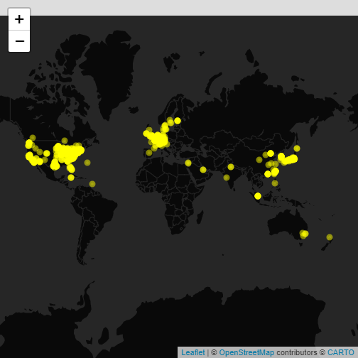

> This is the ropensci [blog post](https://ropensci.org/blog/2017/09/19/patentsview/) from 2017-09-12 that announced the creation of the original patentsview package, edited to work with the new version of the R package and API.


## Why care about patents?

**1. Patents play a critical role in incentivizing innovation, without which we wouldn't have much of the technology we rely on everyday**

What does your iPhone, Google's PageRank algorithm, and a butter substitute called Smart Balance all have in common? 

<span> <!-- These are open source images taken from: https://pixabay.com/ -->


</span>

...They all probably wouldn't be here if not for patents. A patent provides its owner with the ability to make money off of something that they invented, without having to worry about someone else copying their technology. Think Apple would spend millions of dollars developing the iPhone if Samsung could just come along and [rip it off](http://www.reuters.com/article/us-apple-samsung-elec-appeal-idUSKCN1271LF)? Probably not. 

**2. Patents offer a great opportunity for data analysis**

There are two primary reasons for this:

  - **Patent data is public**. In return for the exclusive right to profit off an invention, an individual/company has to publicly disclose the details of their invention to the rest of the world. [Examples of those details](https://patft.uspto.gov/netacgi/nph-Parser?Sect1=PTO2&Sect2=HITOFF&p=1&u=%2Fnetahtml%2FPTO%2Fsearch-bool.html&r=11&f=G&l=50&co1=AND&d=PTXT&s1=dog&OS=dog&RS=dog) include the patent's title, abstract, technology classification, assigned organizations, etc.
  - **Patent data can answer questions that people care about**. Companies (especially big ones like IBM and Google) have a vested interest in extracting insights from patents, and spend a lot of time/resources trying figure out how to best manage their intellectual property (IP) rights.  They're plagued by questions like "who should I sell my underperforming patents to," "which technology areas are open to new innovations," "what's going to be the next big thing in the world of buttery spreads," etc. Patents offer a way to provide data-driven answers to these questions.

Combined, these two things make patents a prime target for data analysis. However, until recently it was hard to get at the data inside these documents. One had to either collect it manually using the official [United States Patent and Trademark Office](https://en.wikipedia.org/wiki/United_States_Patent_and_Trademark_Office) (USPTO) [search engine](https://ppubs.uspto.gov/pubwebapp/), or figure out a way to download, parse, and model huge XML data dumps. Enter PatentsView.

## PatentsView and the `patentsview` package

[PatentsView](https://datatool.patentsview.org/#viz/relationships) is one of USPTO's new initiatives intended to increase the usability and value of patent data. One feature of this project is a publicly accessible API that makes it easy to programmatically interact with the data. A few of the reasons why I like the API (and PatentsView more generally):

* An API key is now required (request one [here](https://patentsview.org/apis/keyrequest)) and throttling is imposed (handled by the new version of the R package) at 45 requests per minute.
* The project offers [bulk downloads of patent data](https://patentsview.org/download/data-download-tables) on their website (in a flat file format), for those who want to be closest to the data. 
* Both the API and the bulk download data contain disambiguated entities such as inventors, assignees, organizations, etc. In other words, the API will tell you whether it thinks that John Smith on patent X is the same person as John Smith on patent Y.[^1]  

The `patentsview` R package is a wrapper around the PatentsView API. It contains a function that acts as a client to the API (`search_pv()`) as well as several supporting functions. Full documentation of the package can be found on its [website](https://ropensci.github.io/patentsview/index.html).

## Installation

You can install the stable version of `patentsview` from r-universe:


```r
options(repos = c(
  patentsview = "https://mustberuss.r-universe.dev/",
  CRAN = "https://cloud.r-project.org"
))

install.packages("patentsview")
```

Or  from GitHub:


```r
if (!require(devtools)) install.packages("devtools")
   devtools::install_github("mustberuss/patentsview@api-redesign")

```

## Getting started

The package has one main function, `search_pv()`, that makes it easy to send requests to the API. There are two parameters to `search_pv()` that you're going to want to think about just about every time you call it - `query` and `fields`. You tell the API how you want to filter the patent data with `query`, and which fields you want to retrieve with `fields`.[^2] 

### `query`

Your query has to use the [PatentsView query language](https://patentsview.org/apis/api-query-language), which is a JSON-based syntax that is similar to the one used by Lucene. You can write the query directly and pass it as a string to `search_pv()`:


```r
library(patentsview)

qry_1 <- '{"_gt":{"patent_year":2007}}'
search_pv(query = qry_1, fields = NULL) # This will retrieve a default set of fields
#> $data
#> #### A list with a single data frame on patents level:
#> 
#> List of 1
#>  $ patents:'data.frame':	1000 obs. of  3 variables:
#>   ..$ patent_id   : chr [1:1000] "10000000" ...
#>   ..$ patent_title: chr [1:1000] "Coherent LADAR using intra-pixel quadrature"..
#>   ..$ patent_date : chr [1:1000] "2018-06-19" ...
#> 
#> $query_results
#> #### Distinct entity counts across all downloadable pages of output:
#> 
#> total_hits = 4,896,259
```

...Or you can use the domain specific language (DSL) provided in the `patentsview` package to help you write the query:


```r
qry_2 <- qry_funs$gt(patent_year = 2007) # All DSL functions are in the qry_funs list
qry_2 # qry_2 is the same as qry_1
#> {"_gt":{"patent_year":2007}}

search_pv(query = qry_2)
#> $data
#> #### A list with a single data frame on patents level:
#> 
#> List of 1
#>  $ patents:'data.frame':	1000 obs. of  3 variables:
#>   ..$ patent_id   : chr [1:1000] "10000000" ...
#>   ..$ patent_title: chr [1:1000] "Coherent LADAR using intra-pixel quadrature"..
#>   ..$ patent_date : chr [1:1000] "2018-06-19" ...
#> 
#> $query_results
#> #### Distinct entity counts across all downloadable pages of output:
#> 
#> total_hits = 4,896,259
```

`qry_1` and `qry_2` will result in the same HTTP call to the API. Both queries search for patents in USPTO that were published after 2007. There are three gotchas to look out for when writing a query:

1. **All Fields are now queryable.** The API has 12 endpoints (the default endpoint is "patents"), and each endpoint has its own set of fields that you can filter on. 
2. **Correct data type for field.** If you're filtering on a field in your query, you have to make sure that the value you are filtering on is consistent with the field's data type. For example, `patent_year` has type "integer," so if you pass 2007 as a string then you're going to get an error (`patent_year = 2007` is good, `patent_year = "2007"` is no good). You can find a field's data type in the `fieldsdf` data frame.
3. **Comparison function works with field's data type.** The comparison function(s) that you use (e.g., the greater-than function shown above, `qry_funs$gt()`) must be consistent with the field's data type. For example, you can't use the "contains" function on fields of type "integer" (`qry_funs$contains(patent_year = 2007)` will throw an error). See `?qry_funs` for more details.

In short, use the `fieldsdf` data frame when you write a query and you should be fine. Check out the [writing queries vignette](https://ropensci.github.io/patentsview/articles/writing-queries.html) for more details.

### `fields`

Up until now we have been using the default value for `fields`. This results in the API giving us some small set of default fields. Let's see about retrieving some more fields:

With the original verison of the API we requested patent_average_processing_time and inventor_total_num_patents.  These fields are no longer available from the patents endpoint.


```r
search_pv(
  query = qry_funs$gt(patent_year = 2007),
  fields = c("patent_abstract", "inventors.inventor_name_first")
)
#> $data
#> #### A list with a single data frame (with list column(s) inside) on patents level:
#> 
#> List of 1
#>  $ patents:'data.frame':	1000 obs. of  2 variables:
#>   ..$ patent_abstract: chr [1:1000] "A frequency modulated (coherent) laser d"..
#>   ..$ inventors      :List of 1000
#> 
#> $query_results
#> #### Distinct entity counts across all downloadable pages of output:
#> 
#> total_hits = 4,896,259
```

The fields that you can retrieve depends on the endpoint that you are hitting. We've been using the "patents" endpoint thus far, so all of these are retrievable: `fieldsdf[fieldsdf$endpoint == "patents", "field"]`. You can also use `get_fields()` to list the retrievable fields for a given endpoint:


```r
search_pv(
  query = qry_funs$gt(patent_year = 2007),
  fields = get_fields(endpoint = "patents", groups = c("patents", "inventors"))
)
#> $data
#> #### A list with a single data frame (with list column(s) inside) on patents level:
#> 
#> List of 1
#>  $ patents:'data.frame':	1000 obs. of  19 variables:
#>   ..$ patent_id                                                   : chr [1:10"..
#>   ..$ patent_title                                                : chr [1:10"..
#>   ..$ patent_type                                                 : chr [1:10"..
#>   ..$ patent_date                                                 : chr [1:10"..
#>   ..$ patent_year                                                 : int [1:100..
#>   ..$ patent_abstract                                             : chr [1:10"..
#>   ..$ patent_cpc_current_group_average_patent_processing_days     : int [1:100..
#>   ..$ patent_detail_desc_length                                   : int [1:100..
#>   ..$ patent_earliest_application_date                            : chr [1:10"..
#>   ..$ patent_num_foreign_documents_cited                          : int [1:100..
#>   ..$ patent_num_times_cited_by_us_patents                        : int [1:100..
#>   ..$ patent_num_total_documents_cited                            : int [1:100..
#>   ..$ patent_num_us_applications_cited                            : int [1:100..
#>   ..$ patent_num_us_patents_cited                                 : int [1:100..
#>   ..$ patent_processing_days                                      : int [1:100..
#>   ..$ patent_term_extension                                       : int [1:100..
#>   ..$ gov_interest_statement                                      : chr [1:100..
#>   ..$ patent_uspc_current_mainclass_average_patent_processing_days: logi [1:10..
#>   ..$ inventors                                                   :List of 1000
#> 
#> $query_results
#> #### Distinct entity counts across all downloadable pages of output:
#> 
#> total_hits = 4,896,259
```

## Example

Let's look at a quick example of pulling and analyzing patent data. We'll look at patents from the last ten years that are classified below the [H04L63/00 CPC code](https://worldwide.espacenet.com/classification#!/CPC=H04L63/02). Patents in this area relate to "network architectures or network communication protocols for separating internal from external traffic."[^3] CPC codes offer a quick and dirty way to find patents of interest, though getting a sense of their hierarchy can be tricky.

1. Download the data


```r
library(patentsview)

# The original post's query is not currently possible with the current version of the new API.
# This may be reworked if/when the patents endpoint is fixed.  The patents endpoint is supposed 
# to assignees.assignee_location_id which we could then look up its latitude and longitude
# at the location endpoint.  The problem is that currently the assignees.assignee_location_id
# is not being returned by the new version of the API.

# Here we'll use a query that is currently possible, one which returns latitudes and longitudes
# We'll query the assignees endpoint for non-empty assignee_organization, where their assignee_individual_name_first and assignee_individual_name_last should be empty
# The sort will be by assignee_num_patents descending so we'll get a list of the most proflic assignee_organizations

query <- with_qfuns( # with_qfuns is basically just: with(qry_funs, ...)
  neq("assignee_organization" = "")
)

# Create a list of fields:
# We request the fields we will use below rather than requesting them all and 
# then filtering to get just the ones we want
fields <- c("assignee_id", "assignee_organization", "assignee_num_patents",
   "assignee_lastknown_latitude", "assignee_lastknown_longitude")

# Send HTTP request to API's server:
pv_res <- search_pv(endpoint = "assignees", query = query, fields = fields, 
   sort = c("assignee_num_patents" = "desc"), all_pages = FALSE)
```

2. See where the assignees are coming from (geographically) 


```r
library(leaflet)
library(htmltools)
library(dplyr)
library(tidyr)
library(stringr)

# my mom was an English teacher, so below we singularize/pluralize Patents
# or maybe Patents:1 was ok?  Here because of the sort it will be unlikely
# that there will be a single patent in our results.

data <-
  pv_res$data$assignees %>%
  mutate(popup = paste0(
    "<font color='Black'>",
    htmlEscape(assignee_organization), "<br><br>Patent",
    ifelse(assignee_num_patents == 1, ":", "s:"), # singular/plural
    assignee_num_patents, "</font>"
  )) %>%
  filter_at(vars(assignee_lastknown_latitude, assignee_lastknown_longitude), any_vars(!is.na(.))) # seeing NA lats and longs

leaflet(data) %>%
  addProviderTiles(providers$CartoDB.DarkMatterNoLabels) %>%
  addCircleMarkers(
    lng = ~assignee_lastknown_longitude, lat = ~assignee_lastknown_latitude,
    popup = ~popup, radius=2, color = "yellow"
  )
```



<br>

3. Plot the growth of the field's topics over time


```r
library(ggplot2)
library(RColorBrewer)

# Here we issue the original post's query, rewritten for the new version of the API
query <- with_qfuns( # with_qfuns is basically just: with(qry_funs, ...)
  and(
    begins(cpc_current.cpc_group_id = "H04L63/02"),
    gte(patent_year = 2007)
  )
)

# Create a list of fields:
fields <- c(
  c("patent_id", "patent_year"),
  get_fields(endpoint = "patents", groups = c("assignees", "cpc_current"))
)

pv_res <- search_pv(query = query, fields = fields, all_pages = TRUE)

# In the new version of the API, we don't get the CPC title back from the patents endpoint
# we have to call, you guessed it, the cpc_group endpoint now
qry <- qry_funs$begins(cpc_group_id = "H04L63/02")
qry
#> {"_begins":{"cpc_group_id":"H04L63/02"}}

cpc_info <- search_pv(query = qry, fields = get_fields("cpc_groups"), endpoint = "cpc_groups")

# More API craziness, in the HATEAS link from the patents endpoint, the separator is
# inexplicably a colon.  In the data that comes back from the cpc_groups endpoint, the
# separator is, get this, a slash like it should be.  All that to say that joining
# becomes a bit problematic or an exercise that makes dplyr wonder what we're up to.

data <-
  pv_res$data$patents %>%
  unnest(cpc_current) %>%
  mutate(cpc_group = sub(".*/([\\w:]+)/$", "\\1", cpc_group, perl = TRUE)) %>% # unHATEOAS cpc_group, funky colon and all
  filter(cpc_group != "H04L63:02") %>% # remove patents categorized into only top-level category of H04L63/02
  mutate(cpc_group = sub(":", "/", cpc_group)) %>% # back to normality, ahead of a join
  inner_join(cpc_info$data$cpc_groups, by = "cpc_group_id") %>%
  ungroup() %>%
  mutate(
    title = case_when(
      grepl("filtering", .$cpc_group_title, ignore.case = T) ~
        "Filtering policies",
      .$cpc_group %in% c("H04L63/0209", "H04L63/0218") ~
        "Architectural arrangements",
      grepl("Firewall traversal", .$cpc_group_title, ignore.case = T) ~
        "Firewall traversal",
      TRUE ~
        .$cpc_group_title
    )
  ) %>%
  mutate(title = gsub(".*(?=-)-", "", title, perl = TRUE)) %>%
  group_by(title, patent_year) %>%
  count() %>%
  ungroup()

max_year <- max(data$patent_year)
y_limit <- max(data$n) + 100 - (max(data$n) %% 100) # even hundred past the max

ggplot(data = data) +
  geom_smooth(aes(x = patent_year, y = n, colour = title), se = FALSE) +
  scale_x_continuous("\nGrant year",
    limits = c(2007, max_year),
    breaks = 2007:max_year
  ) +
  scale_y_continuous("Patents\n", limits = c(0, y_limit)) +
  scale_colour_manual("", values = brewer.pal(5, "Set2")) +
  theme_bw() + # theme inspired by https://hrbrmstr.github.io/hrbrthemes/
  theme(panel.border = element_blank(), axis.ticks = element_blank()) +
  theme(axis.text.x = element_text(angle = 90, vjust = 0.5, hjust=1))
```


## Learning more

For analysis examples that go into a little more depth, check out the [data applications vignettes](https://ropensci.github.io/patentsview/articles/citation-networks.html) on the package's website. If you're just interested in `search_pv()`, there are [examples](https://ropensci.github.io/patentsview/articles/examples.html) on the site for that as well. To contribute to the package or report an issue, check out the [issues page on GitHub](https://github.com/ropensci/patentsview/issues).

## Acknowledgments

I'd like to thank the package's two reviewers, [Paul Oldham](https://github.com/poldham) and [Verena Haunschmid](http://blog.haunschmid.name/), for taking the time to review the package and providing helpful feedback. I'd also like to thank [Maëlle Salmon](http://www.masalmon.eu/) for shepherding the package along the rOpenSci review process, as well [Scott Chamberlain](https://scottchamberlain.info/) and [Stefanie Butland](https://twitter.com/stefaniebutland) for their miscellaneous help.

[^1]: This is both good and bad, as there are errors in the disambiguation. The algorithm that is responsible for the disambiguation was created by the winner of the [PatentsView Inventor Disambiguation Technical Workshop](http://www.patentsview.org/workshop/).
[^2]: These two parameters end up getting translated into a MySQL query by the API's server, which then gets sent to a back-end database. `query` and `fields` are used to create the query's `WHERE` and `SELECT` clauses, respectively.
[^3]: There is a slightly more in-depth definition that says that these are patents "related to the (logical) separation of traffic/(sub-) networks to achieve protection." 
