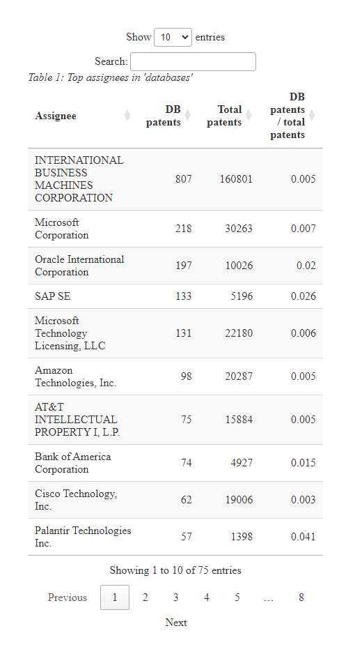
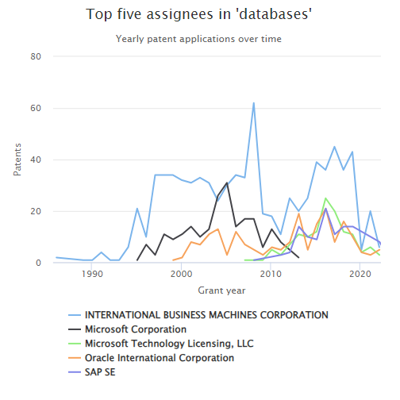

> Note about the effects of the [API changes](api-changes.html).
>
> This is a good example of life under the new version of the API, where we have to make more than one call to get the same data as before. This assumes that we have already received an API key and have set the environmental variable (see the API Changes page). Maybe even keep the old page around for comparison?
> For now the original Top Assignees page is [here](https://docs.ropensci.org/patentsview/articles/top-assignees.html).
>
> Intention:  
> The original version of this page used the patent's application date in the plot below.  In the new version of the API there is a patent_year (the year the patent was granted, already of type integer) that we'll use.  Trouble is that the count is nested inside the patents structure, not inside the nested assignees.  Fortunately both nested structures have patent_id as a field so we can join them to get the data we need.
>
> In the original version of this page we searched for database (singular) but now that produces a result set of over 10,000 rows.  Instead, we'll search for databases (plural) which will make our result set smaller.  
>
> We start by calling the patent endpoint to get the patents where "databases" is in the title or abstract and there is an assignee. We make a subsequent call to the assignee endpoint to get assignee_num_patents (total number of patents) for the top 75 assignees, then we blend in the assignee_num_patents and compute the percentages. Then life, and the script, goes on as normal (as the original script did). 

The following is a quick analysis of the top organizations patenting in the field of databases.

1. The first step is to download the relevant data fields from the PatentsView API:


``` r
library(patentsview)
library(dplyr)
library(highcharter)
library(DT)
library(knitr)

# We first need to write a query. Our query will look for "databases" in either 
# the patent title or abstract...Note, this isn't a terribly good way to ID our 
# patents, but it will work for the purpose of demonstration. Users who are 
# interested in writing higher-quality queries could consult the large body of 
# research that has been done in field of patent document retrieval.
query <- with_qfuns(
  and(
     neq("assignees.assignee_organization" = ""),
     or(
       text_phrase(patent_abstract = "databases"),
       contains(patent_title = "databases")
     )
   )
)

query
#> {"_and":[{"_neq":{"assignees.assignee_organization":""}},{"_or":[{"_text_phrase":{"patent_abstract":"databases"}},{"_contains":{"patent_title":"databases"}}]}]}

# Create a list of the fields we'll need for the analysis.
# We'll request both "patent_earliest_application_date" and
# "applications.filing_date" so that either could be used
# in the plot below

fields <- c(
  "patent_id", "patent_date", "patent_year", "patent_earliest_application_date",
  "patent_num_us_patents_cited", "application.filing_date",
  "assignees.assignee_organization",
  "assignees.assignee_id"  # the assignee fields come back in a nested object
)

# Send an HTTP request to the PatentsView API to get the data
pv_out <- search_pv(query, fields = fields, all_pages = TRUE, size = 1000)
#> [1] "https://search.patentsview.org/api/v1/patent/?q=%7B%22_and%22%3A%5B%7B%22_neq%22%3A%7B%22assignees.assignee_organization%22%3A%22%22%7D%7D%2C%7B%22_or%22%3A%5B%7B%22_text_phrase%22%3A%7B%22patent_abstract%22%3A%22databases%22%7D%7D%2C%7B%22_contains%22%3A%7B%22patent_title%22%3A%22databases%22%7D%7D%5D%7D%5D%7D&f=[\"patent_id\",\"patent_date\",\"patent_year\",\"patent_earliest_application_date\",\"patent_num_us_patents_cited\",\"application.filing_date\",\"assignees.assignee_organization\",\"assignees.assignee_id\"]&s=[{\"patent_id\":\"asc\"}]&o={\"size\":1000,\"after\":\"\"}"
#> [1] "https://search.patentsview.org/api/v1/patent/?q=%7B%22_and%22%3A%5B%7B%22_neq%22%3A%7B%22assignees.assignee_organization%22%3A%22%22%7D%7D%2C%7B%22_or%22%3A%5B%7B%22_text_phrase%22%3A%7B%22patent_abstract%22%3A%22databases%22%7D%7D%2C%7B%22_contains%22%3A%7B%22patent_title%22%3A%22databases%22%7D%7D%5D%7D%5D%7D&f=[\"patent_id\",\"patent_date\",\"patent_year\",\"patent_earliest_application_date\",\"patent_num_us_patents_cited\",\"application.filing_date\",\"assignees.assignee_organization\",\"assignees.assignee_id\"]&s=[{\"patent_id\":\"asc\"}]&o={\"size\":1000,\"after\":\"\"}"
#> [1] "https://search.patentsview.org/api/v1/patent/?q=%7B%22_and%22%3A%5B%7B%22_neq%22%3A%7B%22assignees.assignee_organization%22%3A%22%22%7D%7D%2C%7B%22_or%22%3A%5B%7B%22_text_phrase%22%3A%7B%22patent_abstract%22%3A%22databases%22%7D%7D%2C%7B%22_contains%22%3A%7B%22patent_title%22%3A%22databases%22%7D%7D%5D%7D%5D%7D&f=[\"patent_id\",\"patent_date\",\"patent_year\",\"patent_earliest_application_date\",\"patent_num_us_patents_cited\",\"application.filing_date\",\"assignees.assignee_organization\",\"assignees.assignee_id\"]&s=[{\"patent_id\":\"asc\"}]&o={\"size\":1000,\"after\":\"10762042\"}"
#> [1] "https://search.patentsview.org/api/v1/patent/?q=%7B%22_and%22%3A%5B%7B%22_neq%22%3A%7B%22assignees.assignee_organization%22%3A%22%22%7D%7D%2C%7B%22_or%22%3A%5B%7B%22_text_phrase%22%3A%7B%22patent_abstract%22%3A%22databases%22%7D%7D%2C%7B%22_contains%22%3A%7B%22patent_title%22%3A%22databases%22%7D%7D%5D%7D%5D%7D&f=[\"patent_id\",\"patent_date\",\"patent_year\",\"patent_earliest_application_date\",\"patent_num_us_patents_cited\",\"application.filing_date\",\"assignees.assignee_organization\",\"assignees.assignee_id\"]&s=[{\"patent_id\":\"asc\"}]&o={\"size\":1000,\"after\":\"11402216\"}"
#> [1] "https://search.patentsview.org/api/v1/patent/?q=%7B%22_and%22%3A%5B%7B%22_neq%22%3A%7B%22assignees.assignee_organization%22%3A%22%22%7D%7D%2C%7B%22_or%22%3A%5B%7B%22_text_phrase%22%3A%7B%22patent_abstract%22%3A%22databases%22%7D%7D%2C%7B%22_contains%22%3A%7B%22patent_title%22%3A%22databases%22%7D%7D%5D%7D%5D%7D&f=[\"patent_id\",\"patent_date\",\"patent_year\",\"patent_earliest_application_date\",\"patent_num_us_patents_cited\",\"application.filing_date\",\"assignees.assignee_organization\",\"assignees.assignee_id\"]&s=[{\"patent_id\":\"asc\"}]&o={\"size\":1000,\"after\":\"4819156\"}"
#> [1] "https://search.patentsview.org/api/v1/patent/?q=%7B%22_and%22%3A%5B%7B%22_neq%22%3A%7B%22assignees.assignee_organization%22%3A%22%22%7D%7D%2C%7B%22_or%22%3A%5B%7B%22_text_phrase%22%3A%7B%22patent_abstract%22%3A%22databases%22%7D%7D%2C%7B%22_contains%22%3A%7B%22patent_title%22%3A%22databases%22%7D%7D%5D%7D%5D%7D&f=[\"patent_id\",\"patent_date\",\"patent_year\",\"patent_earliest_application_date\",\"patent_num_us_patents_cited\",\"application.filing_date\",\"assignees.assignee_organization\",\"assignees.assignee_id\"]&s=[{\"patent_id\":\"asc\"}]&o={\"size\":1000,\"after\":\"6370548\"}"
#> [1] "https://search.patentsview.org/api/v1/patent/?q=%7B%22_and%22%3A%5B%7B%22_neq%22%3A%7B%22assignees.assignee_organization%22%3A%22%22%7D%7D%2C%7B%22_or%22%3A%5B%7B%22_text_phrase%22%3A%7B%22patent_abstract%22%3A%22databases%22%7D%7D%2C%7B%22_contains%22%3A%7B%22patent_title%22%3A%22databases%22%7D%7D%5D%7D%5D%7D&f=[\"patent_id\",\"patent_date\",\"patent_year\",\"patent_earliest_application_date\",\"patent_num_us_patents_cited\",\"application.filing_date\",\"assignees.assignee_organization\",\"assignees.assignee_id\"]&s=[{\"patent_id\":\"asc\"}]&o={\"size\":1000,\"after\":\"7120628\"}"
#> [1] "https://search.patentsview.org/api/v1/patent/?q=%7B%22_and%22%3A%5B%7B%22_neq%22%3A%7B%22assignees.assignee_organization%22%3A%22%22%7D%7D%2C%7B%22_or%22%3A%5B%7B%22_text_phrase%22%3A%7B%22patent_abstract%22%3A%22databases%22%7D%7D%2C%7B%22_contains%22%3A%7B%22patent_title%22%3A%22databases%22%7D%7D%5D%7D%5D%7D&f=[\"patent_id\",\"patent_date\",\"patent_year\",\"patent_earliest_application_date\",\"patent_num_us_patents_cited\",\"application.filing_date\",\"assignees.assignee_organization\",\"assignees.assignee_id\"]&s=[{\"patent_id\":\"asc\"}]&o={\"size\":1000,\"after\":\"7774297\"}"
#> [1] "https://search.patentsview.org/api/v1/patent/?q=%7B%22_and%22%3A%5B%7B%22_neq%22%3A%7B%22assignees.assignee_organization%22%3A%22%22%7D%7D%2C%7B%22_or%22%3A%5B%7B%22_text_phrase%22%3A%7B%22patent_abstract%22%3A%22databases%22%7D%7D%2C%7B%22_contains%22%3A%7B%22patent_title%22%3A%22databases%22%7D%7D%5D%7D%5D%7D&f=[\"patent_id\",\"patent_date\",\"patent_year\",\"patent_earliest_application_date\",\"patent_num_us_patents_cited\",\"application.filing_date\",\"assignees.assignee_organization\",\"assignees.assignee_id\"]&s=[{\"patent_id\":\"asc\"}]&o={\"size\":1000,\"after\":\"8375046\"}"
#> [1] "https://search.patentsview.org/api/v1/patent/?q=%7B%22_and%22%3A%5B%7B%22_neq%22%3A%7B%22assignees.assignee_organization%22%3A%22%22%7D%7D%2C%7B%22_or%22%3A%5B%7B%22_text_phrase%22%3A%7B%22patent_abstract%22%3A%22databases%22%7D%7D%2C%7B%22_contains%22%3A%7B%22patent_title%22%3A%22databases%22%7D%7D%5D%7D%5D%7D&f=[\"patent_id\",\"patent_date\",\"patent_year\",\"patent_earliest_application_date\",\"patent_num_us_patents_cited\",\"application.filing_date\",\"assignees.assignee_organization\",\"assignees.assignee_id\"]&s=[{\"patent_id\":\"asc\"}]&o={\"size\":1000,\"after\":\"9128975\"}"
pv_out
#> $data
#> #### A list with a single data frame (with list column(s) inside) on patents level:
#> 
#> List of 1
#>  $ patents:'data.frame':	8937 obs. of  7 variables:
#>   ..$ patent_id                       : chr [1:8937] "10000987" ...
#>   ..$ patent_date                     : chr [1:8937] "2018-06-19" ...
#>   ..$ patent_year                     : int [1:8937] 2018 2018 ...
#>   ..$ patent_earliest_application_date: chr [1:8937] "2014-02-20" ...
#>   ..$ patent_num_us_patents_cited     : int [1:8937] 163 7 ...
#>   ..$ application                     :List of 8937
#>   ..$ assignees                       :List of 8937
#> 
#> $query_results
#> #### Distinct entity counts across all downloadable pages of output:
#> 
#> total_hits = 8,937
```

2. Now let's identify who the top assignees are based on how many patents they have in our data set. We'll also calculate how many total patents these assignees have and what fraction of their total patents relate to databases.


``` r

# Unnest the data frames that are stored in the assignee list column
dl <- unnest_pv_data(pv_out$data, "patent_id")
dl
#> List of 3
#>  $ application:'data.frame':	8937 obs. of  2 variables:
#>   ..$ patent_id  : chr [1:8937] "10000987" ...
#>   ..$ filing_date: chr [1:8937] "2014-02-20" ...
#>  $ assignees  :'data.frame':	8440 obs. of  3 variables:
#>   ..$ patent_id            : chr [1:8440] "10000987" ...
#>   ..$ assignee             : chr [1:8440] "https://search.patentsview.org/api"..
#>   ..$ assignee_organization: chr [1:8440] "National Oilwell Varco, L.P." ...
#>  $ patents    :'data.frame':	8937 obs. of  5 variables:
#>   ..$ patent_id                       : chr [1:8937] "10000987" ...
#>   ..$ patent_date                     : chr [1:8937] "2018-06-19" ...
#>   ..$ patent_year                     : int [1:8937] 2018 2018 ...
#>   ..$ patent_earliest_application_date: chr [1:8937] "2014-02-20" ...
#>   ..$ patent_num_us_patents_cited     : int [1:8937] 163 7 ...

# We don't get the assignee_total_num_patents back from the patent endpoint any longer.
# We'll have to make a call to the assignee endpoint once we know who the top 75
# assignees are.

# We requested assignees.assignee_id but it comes back in the assignees object
# with key "assignee" (the _id clipped off) and a GUID looking value ex:
# https://search.patentsview.org/api/v1/assignee/4e49a0a0-16c8-11ed-9b5f-1234bde3cd05/
# We want to parse out the assignee_ids, ex: 4e49a0a0-16c8-11ed-9b5f-1234bde3cd05
# (The API's documetation shows that the assignee URL parameter is the assignee_id)

# Create a data frame with the top 75 assignees:
top_asgns <-
  dl$assignees %>%
    mutate(assignee_id = sub(".*/([0-9a-f-]+)/$", "\\1", assignee)) %>%
    group_by(assignee_organization, assignee_id) %>% 
    summarise(db_pats = n()) %>% 
    ungroup() %>%
    arrange(desc(db_pats)) %>%
    slice(1:75)

# Now that we have the assignee_id's,  we can make a single call to the assignee
# endpoint to get the total number of patents for each of our top_asgns. (One
# call rather than 75 calls using the unparsed "assignee" URLs)

assignee_query =  qry_funs$eq(assignee_id = top_asgns$assignee_id)

assignee_fields <- c(
  "assignee_id", "assignee_organization", "assignee_num_patents"
)

# We'll post to the API, the query is a pretty large string (an "or" of 75 assignee_ids)
assignee_out <- search_pv(assignee_query , fields = assignee_fields, all_pages = TRUE, 
   size = 1000, endpoint = "assignee", method = "POST")
#> [1] "body {\"q\":{\"_or\":[{\"_eq\":{\"assignee_id\":\"595b50fb-aa1d-4d37-9c04-645f2dea0095\"}},{\"_eq\":{\"assignee_id\":\"af0ef413-667a-4a11-8554-d23585f74ce3\"}},{\"_eq\":{\"assignee_id\":\"38c01f31-61ac-467f-bce3-6c4740696a33\"}},{\"_eq\":{\"assignee_id\":\"de7146a5-3ca0-4a49-9d6c-5aabc60e04a8\"}},{\"_eq\":{\"assignee_id\":\"9dee7ef4-71eb-49d0-92c3-6c7a8fe2c402\"}},{\"_eq\":{\"assignee_id\":\"30b45372-8201-4090-af72-16a59219d0fb\"}},{\"_eq\":{\"assignee_id\":\"1d358029-0967-498f-ac2d-fc0a2dcb9283\"}},{\"_eq\":{\"assignee_id\":\"701812b0-302a-4f61-bc57-da743356cf16\"}},{\"_eq\":{\"assignee_id\":\"c2a0ef79-57e5-45c4-9896-5c2473d40c19\"}},{\"_eq\":{\"assignee_id\":\"c42ad003-3194-40d6-8bde-4d2790cfa7d2\"}},{\"_eq\":{\"assignee_id\":\"25e76278-3c29-4833-81d7-e377eccb490b\"}},{\"_eq\":{\"assignee_id\":\"186ac966-9f87-469e-b3a8-597253399764\"}},{\"_eq\":{\"assignee_id\":\"7d298dc5-de2c-4a77-9053-07edf0706402\"}},{\"_eq\":{\"assignee_id\":\"32841677-04f2-476c-bb43-b3dde227cabf\"}},{\"_eq\":{\"assignee_id\":\"8ef0e1b6-1318-4479-af2a-d9c0932f1f3c\"}},{\"_eq\":{\"assignee_id\":\"8ea3bb29-e574-4d36-9d23-c26a9680fe3f\"}},{\"_eq\":{\"assignee_id\":\"f8186647-9e05-49af-bbc2-a13f6d5c4af0\"}},{\"_eq\":{\"assignee_id\":\"744f6a67-8421-4bdc-abbf-0f1aee8d5102\"}},{\"_eq\":{\"assignee_id\":\"ba5f59c1-c0df-405f-bc55-adb6ca989939\"}},{\"_eq\":{\"assignee_id\":\"fff7e330-d948-44ea-adb7-7fa33d1ede3b\"}},{\"_eq\":{\"assignee_id\":\"279f75ab-468c-4b71-a6b3-80a9cf9b74c7\"}},{\"_eq\":{\"assignee_id\":\"4b96b431-92e4-421d-864e-d0bb06ed491a\"}},{\"_eq\":{\"assignee_id\":\"87ba0381-4d81-4e43-b7c1-14dd8f4b8d10\"}},{\"_eq\":{\"assignee_id\":\"045ae670-8fc3-4e49-ae6d-0c7c17dbc05c\"}},{\"_eq\":{\"assignee_id\":\"bc39ae54-8541-4e14-bdd6-04f398aaedca\"}},{\"_eq\":{\"assignee_id\":\"3c63c206-a203-45d9-959a-8173cb8f15c5\"}},{\"_eq\":{\"assignee_id\":\"e4aa0ff9-09c6-44f5-aef9-da32176426a5\"}},{\"_eq\":{\"assignee_id\":\"4ae58aae-4e96-4c71-8f86-ee6ea079bb4c\"}},{\"_eq\":{\"assignee_id\":\"d4b5cd5a-0d05-41a5-95ed-be97ac44df12\"}},{\"_eq\":{\"assignee_id\":\"db48f97b-b7a8-4c4d-bc3b-70010a679b94\"}},{\"_eq\":{\"assignee_id\":\"035cee76-da76-414f-80d5-65cf98930187\"}},{\"_eq\":{\"assignee_id\":\"c826b2a9-17fd-473d-aa09-4db529768094\"}},{\"_eq\":{\"assignee_id\":\"cc58ebe9-835a-4d55-9117-3ce64d21f5ee\"}},{\"_eq\":{\"assignee_id\":\"5e04f8ae-68c5-4ebf-869c-fcc4f845fa27\"}},{\"_eq\":{\"assignee_id\":\"c002f460-9a39-4c37-91b7-b225191cd4ff\"}},{\"_eq\":{\"assignee_id\":\"ccadbdcd-d5cc-442f-94f5-c6245631eab7\"}},{\"_eq\":{\"assignee_id\":\"ecd558b1-84ab-4a32-a8a5-993a553eeb69\"}},{\"_eq\":{\"assignee_id\":\"a1c32670-b276-44f4-99f5-d9c5163cf7b3\"}},{\"_eq\":{\"assignee_id\":\"0f4de6a1-1915-4475-8bab-0a76c726d3a8\"}},{\"_eq\":{\"assignee_id\":\"57411025-d161-4e59-8736-e193d726c1e8\"}},{\"_eq\":{\"assignee_id\":\"4a62d26c-daf6-4b2c-94b6-eb389fe104fc\"}},{\"_eq\":{\"assignee_id\":\"abe517d7-4a02-41b9-8a2d-12d8bb7cf422\"}},{\"_eq\":{\"assignee_id\":\"ad4dd2cc-4c11-41c2-9d0b-c18230d8ecfd\"}},{\"_eq\":{\"assignee_id\":\"458471f5-ecbc-4d88-a0c9-d9cbb772c020\"}},{\"_eq\":{\"assignee_id\":\"6903fc42-4fc8-4a91-a928-d7bc08022e5b\"}},{\"_eq\":{\"assignee_id\":\"cd70c79b-3b73-493e-8cc7-7c26fcceaccf\"}},{\"_eq\":{\"assignee_id\":\"25a8d65c-d0b2-46c8-8cd5-ea62b46d6fed\"}},{\"_eq\":{\"assignee_id\":\"7bbbdd4c-cf98-40fa-a49a-df7d77ddda27\"}},{\"_eq\":{\"assignee_id\":\"593f5308-2755-469e-aa43-a42bebe66ce0\"}},{\"_eq\":{\"assignee_id\":\"25cf09e6-2bf2-4ad5-bc62-d9f99c79bd08\"}},{\"_eq\":{\"assignee_id\":\"ff3c0835-8694-48e4-b605-defa49059b47\"}},{\"_eq\":{\"assignee_id\":\"e3a4e744-7f88-4413-94e5-c0c7fe85ebfc\"}},{\"_eq\":{\"assignee_id\":\"3fdf4ac9-3109-48f0-916b-45349289ec1f\"}},{\"_eq\":{\"assignee_id\":\"1162b386-7160-4dc8-a3fc-a403608c2694\"}},{\"_eq\":{\"assignee_id\":\"c1853440-6082-4d13-a3eb-2eb8a08c90be\"}},{\"_eq\":{\"assignee_id\":\"b5b6e905-8844-45e3-b902-7cfaa63d38fb\"}},{\"_eq\":{\"assignee_id\":\"88536978-f722-408e-812f-364fd57580c6\"}},{\"_eq\":{\"assignee_id\":\"f046f875-5c27-4b8d-b70c-ef487c58e1c8\"}},{\"_eq\":{\"assignee_id\":\"876518c7-102e-400e-afcf-75f618dcaf0d\"}},{\"_eq\":{\"assignee_id\":\"62e2c9d8-cb0a-41a3-835a-ea7759b20d1e\"}},{\"_eq\":{\"assignee_id\":\"ef22dcd3-838e-41e6-9d8c-ceb6dd60ec4d\"}},{\"_eq\":{\"assignee_id\":\"0cd2b6fc-4787-4dfd-9449-dcbc1fb35fbf\"}},{\"_eq\":{\"assignee_id\":\"eebc8394-7f3e-4fe2-80dd-127ced018d19\"}},{\"_eq\":{\"assignee_id\":\"e36cd096-cadf-4cc8-abe5-c2f1647c856a\"}},{\"_eq\":{\"assignee_id\":\"92177faf-be2c-481d-8a28-0139b2ed7216\"}},{\"_eq\":{\"assignee_id\":\"05283454-f061-4195-811f-5db944862e60\"}},{\"_eq\":{\"assignee_id\":\"5890b757-a082-4764-ab1d-a7c8c9a5214f\"}},{\"_eq\":{\"assignee_id\":\"59eb6b3a-66ca-4a1b-9753-187c1e1c3f7b\"}},{\"_eq\":{\"assignee_id\":\"fb5180f9-8dba-4aa2-a698-056566d7987d\"}},{\"_eq\":{\"assignee_id\":\"bfc517ee-27d8-4fb3-be07-d9f67a8f2fb9\"}},{\"_eq\":{\"assignee_id\":\"d71258fc-8b1d-4351-9327-44503a71f8f5\"}},{\"_eq\":{\"assignee_id\":\"43faa90f-e68d-4cee-be39-8e3a0174e7b7\"}},{\"_eq\":{\"assignee_id\":\"b1c33eb1-b4c6-4c5f-ae30-28da8727cdc3\"}},{\"_eq\":{\"assignee_id\":\"1d60d42a-7945-4a37-8e3a-0cc7f6198a48\"}},{\"_eq\":{\"assignee_id\":\"ea6c9dc1-519a-4ae8-86ac-53e35d3444a9\"}}]},\"f\":[\"assignee_id\",\"assignee_organization\",\"assignee_num_patents\"],\"s\":[{\"assignee_id\":\"asc\"}],\"o\":{\"size\":1000,\"after\":\"\"}}"
#> [1] "body {\"q\":{\"_or\":[{\"_eq\":{\"assignee_id\":\"595b50fb-aa1d-4d37-9c04-645f2dea0095\"}},{\"_eq\":{\"assignee_id\":\"af0ef413-667a-4a11-8554-d23585f74ce3\"}},{\"_eq\":{\"assignee_id\":\"38c01f31-61ac-467f-bce3-6c4740696a33\"}},{\"_eq\":{\"assignee_id\":\"de7146a5-3ca0-4a49-9d6c-5aabc60e04a8\"}},{\"_eq\":{\"assignee_id\":\"9dee7ef4-71eb-49d0-92c3-6c7a8fe2c402\"}},{\"_eq\":{\"assignee_id\":\"30b45372-8201-4090-af72-16a59219d0fb\"}},{\"_eq\":{\"assignee_id\":\"1d358029-0967-498f-ac2d-fc0a2dcb9283\"}},{\"_eq\":{\"assignee_id\":\"701812b0-302a-4f61-bc57-da743356cf16\"}},{\"_eq\":{\"assignee_id\":\"c2a0ef79-57e5-45c4-9896-5c2473d40c19\"}},{\"_eq\":{\"assignee_id\":\"c42ad003-3194-40d6-8bde-4d2790cfa7d2\"}},{\"_eq\":{\"assignee_id\":\"25e76278-3c29-4833-81d7-e377eccb490b\"}},{\"_eq\":{\"assignee_id\":\"186ac966-9f87-469e-b3a8-597253399764\"}},{\"_eq\":{\"assignee_id\":\"7d298dc5-de2c-4a77-9053-07edf0706402\"}},{\"_eq\":{\"assignee_id\":\"32841677-04f2-476c-bb43-b3dde227cabf\"}},{\"_eq\":{\"assignee_id\":\"8ef0e1b6-1318-4479-af2a-d9c0932f1f3c\"}},{\"_eq\":{\"assignee_id\":\"8ea3bb29-e574-4d36-9d23-c26a9680fe3f\"}},{\"_eq\":{\"assignee_id\":\"f8186647-9e05-49af-bbc2-a13f6d5c4af0\"}},{\"_eq\":{\"assignee_id\":\"744f6a67-8421-4bdc-abbf-0f1aee8d5102\"}},{\"_eq\":{\"assignee_id\":\"ba5f59c1-c0df-405f-bc55-adb6ca989939\"}},{\"_eq\":{\"assignee_id\":\"fff7e330-d948-44ea-adb7-7fa33d1ede3b\"}},{\"_eq\":{\"assignee_id\":\"279f75ab-468c-4b71-a6b3-80a9cf9b74c7\"}},{\"_eq\":{\"assignee_id\":\"4b96b431-92e4-421d-864e-d0bb06ed491a\"}},{\"_eq\":{\"assignee_id\":\"87ba0381-4d81-4e43-b7c1-14dd8f4b8d10\"}},{\"_eq\":{\"assignee_id\":\"045ae670-8fc3-4e49-ae6d-0c7c17dbc05c\"}},{\"_eq\":{\"assignee_id\":\"bc39ae54-8541-4e14-bdd6-04f398aaedca\"}},{\"_eq\":{\"assignee_id\":\"3c63c206-a203-45d9-959a-8173cb8f15c5\"}},{\"_eq\":{\"assignee_id\":\"e4aa0ff9-09c6-44f5-aef9-da32176426a5\"}},{\"_eq\":{\"assignee_id\":\"4ae58aae-4e96-4c71-8f86-ee6ea079bb4c\"}},{\"_eq\":{\"assignee_id\":\"d4b5cd5a-0d05-41a5-95ed-be97ac44df12\"}},{\"_eq\":{\"assignee_id\":\"db48f97b-b7a8-4c4d-bc3b-70010a679b94\"}},{\"_eq\":{\"assignee_id\":\"035cee76-da76-414f-80d5-65cf98930187\"}},{\"_eq\":{\"assignee_id\":\"c826b2a9-17fd-473d-aa09-4db529768094\"}},{\"_eq\":{\"assignee_id\":\"cc58ebe9-835a-4d55-9117-3ce64d21f5ee\"}},{\"_eq\":{\"assignee_id\":\"5e04f8ae-68c5-4ebf-869c-fcc4f845fa27\"}},{\"_eq\":{\"assignee_id\":\"c002f460-9a39-4c37-91b7-b225191cd4ff\"}},{\"_eq\":{\"assignee_id\":\"ccadbdcd-d5cc-442f-94f5-c6245631eab7\"}},{\"_eq\":{\"assignee_id\":\"ecd558b1-84ab-4a32-a8a5-993a553eeb69\"}},{\"_eq\":{\"assignee_id\":\"a1c32670-b276-44f4-99f5-d9c5163cf7b3\"}},{\"_eq\":{\"assignee_id\":\"0f4de6a1-1915-4475-8bab-0a76c726d3a8\"}},{\"_eq\":{\"assignee_id\":\"57411025-d161-4e59-8736-e193d726c1e8\"}},{\"_eq\":{\"assignee_id\":\"4a62d26c-daf6-4b2c-94b6-eb389fe104fc\"}},{\"_eq\":{\"assignee_id\":\"abe517d7-4a02-41b9-8a2d-12d8bb7cf422\"}},{\"_eq\":{\"assignee_id\":\"ad4dd2cc-4c11-41c2-9d0b-c18230d8ecfd\"}},{\"_eq\":{\"assignee_id\":\"458471f5-ecbc-4d88-a0c9-d9cbb772c020\"}},{\"_eq\":{\"assignee_id\":\"6903fc42-4fc8-4a91-a928-d7bc08022e5b\"}},{\"_eq\":{\"assignee_id\":\"cd70c79b-3b73-493e-8cc7-7c26fcceaccf\"}},{\"_eq\":{\"assignee_id\":\"25a8d65c-d0b2-46c8-8cd5-ea62b46d6fed\"}},{\"_eq\":{\"assignee_id\":\"7bbbdd4c-cf98-40fa-a49a-df7d77ddda27\"}},{\"_eq\":{\"assignee_id\":\"593f5308-2755-469e-aa43-a42bebe66ce0\"}},{\"_eq\":{\"assignee_id\":\"25cf09e6-2bf2-4ad5-bc62-d9f99c79bd08\"}},{\"_eq\":{\"assignee_id\":\"ff3c0835-8694-48e4-b605-defa49059b47\"}},{\"_eq\":{\"assignee_id\":\"e3a4e744-7f88-4413-94e5-c0c7fe85ebfc\"}},{\"_eq\":{\"assignee_id\":\"3fdf4ac9-3109-48f0-916b-45349289ec1f\"}},{\"_eq\":{\"assignee_id\":\"1162b386-7160-4dc8-a3fc-a403608c2694\"}},{\"_eq\":{\"assignee_id\":\"c1853440-6082-4d13-a3eb-2eb8a08c90be\"}},{\"_eq\":{\"assignee_id\":\"b5b6e905-8844-45e3-b902-7cfaa63d38fb\"}},{\"_eq\":{\"assignee_id\":\"88536978-f722-408e-812f-364fd57580c6\"}},{\"_eq\":{\"assignee_id\":\"f046f875-5c27-4b8d-b70c-ef487c58e1c8\"}},{\"_eq\":{\"assignee_id\":\"876518c7-102e-400e-afcf-75f618dcaf0d\"}},{\"_eq\":{\"assignee_id\":\"62e2c9d8-cb0a-41a3-835a-ea7759b20d1e\"}},{\"_eq\":{\"assignee_id\":\"ef22dcd3-838e-41e6-9d8c-ceb6dd60ec4d\"}},{\"_eq\":{\"assignee_id\":\"0cd2b6fc-4787-4dfd-9449-dcbc1fb35fbf\"}},{\"_eq\":{\"assignee_id\":\"eebc8394-7f3e-4fe2-80dd-127ced018d19\"}},{\"_eq\":{\"assignee_id\":\"e36cd096-cadf-4cc8-abe5-c2f1647c856a\"}},{\"_eq\":{\"assignee_id\":\"92177faf-be2c-481d-8a28-0139b2ed7216\"}},{\"_eq\":{\"assignee_id\":\"05283454-f061-4195-811f-5db944862e60\"}},{\"_eq\":{\"assignee_id\":\"5890b757-a082-4764-ab1d-a7c8c9a5214f\"}},{\"_eq\":{\"assignee_id\":\"59eb6b3a-66ca-4a1b-9753-187c1e1c3f7b\"}},{\"_eq\":{\"assignee_id\":\"fb5180f9-8dba-4aa2-a698-056566d7987d\"}},{\"_eq\":{\"assignee_id\":\"bfc517ee-27d8-4fb3-be07-d9f67a8f2fb9\"}},{\"_eq\":{\"assignee_id\":\"d71258fc-8b1d-4351-9327-44503a71f8f5\"}},{\"_eq\":{\"assignee_id\":\"43faa90f-e68d-4cee-be39-8e3a0174e7b7\"}},{\"_eq\":{\"assignee_id\":\"b1c33eb1-b4c6-4c5f-ae30-28da8727cdc3\"}},{\"_eq\":{\"assignee_id\":\"1d60d42a-7945-4a37-8e3a-0cc7f6198a48\"}},{\"_eq\":{\"assignee_id\":\"ea6c9dc1-519a-4ae8-86ac-53e35d3444a9\"}}]},\"f\":[\"assignee_id\",\"assignee_organization\",\"assignee_num_patents\"],\"s\":[{\"assignee_id\":\"asc\"}],\"o\":{\"size\":1000,\"after\":\"\"}}"

assignee_counts <- unnest_pv_data(assignee_out$data, "assignee_id")
assignee_counts
#> List of 1
#>  $ assignees:'data.frame':	75 obs. of  3 variables:
#>   ..$ assignee_id          : chr [1:75] "035cee76-da76-414f-80d5-65cf98930187"..
#>   ..$ assignee_organization: chr [1:75] "SONY GROUP CORPORATION" ...
#>   ..$ assignee_num_patents : int [1:75] 60908 950 ...

# Here we redo top_asgns now that we have all the fields we need.
# We join in the total counts and mutate in the percentages 
top_asgns <- dl$assignees %>%
   inner_join(assignee_counts$assignees) %>%
   rename(ttl_pats = assignee_num_patents) %>%
   group_by(assignee_organization, ttl_pats) %>%
   summarise(db_pats = n()) %>% 
   mutate(frac_db_pats = round(db_pats / ttl_pats, 3)) %>%
   select(c(1, 3, 2, 4))  %>%
   arrange(desc(db_pats))

# trying to avoid Error: Chromote: timed out waiting for event Page.loadEventFired
knitr::opts_chunk$set(
   delay = 30
)
# Create datatable
datatable(
  data = top_asgns,
  rownames = FALSE,
  colnames = c(
    "Assignee", "DB patents", "Total patents", "DB patents / total patents"
  ),
  caption = htmltools::tags$caption(
    style = 'caption-side: top; text-align: left; font-style: italic;',
    "Table 1: Top assignees in 'databases'"
  ),
  options = list(pageLength = 10)
)
```



<br>

IBM is far and away the biggest player in the field. However, we can see that Oracle and Salesforce.com are relatively more interested in this area, as indicated by the fraction of their patents that relate to databases.

3. Let's see how these assignees' level of investment in databases has changed over time.


``` r

# Comment from the original version of this page:
# Create a data frame with patent counts by application year for each assignee

# The patent endpoint can now return "patent_earliest_application_date"  and/or
# application.filing_date.  We requested both above so we can use either here
# to create app_yr.  The API's data dictionary (if one exists) would need to be
# consulted to find out how these fields differ. (There are data dictionaries for
# the bulk downloadable files, I'll follow up with the API team to see if there
# is one for the API.)

# We'll use patent_earliest_application_date, we'd need an additional
# full_join(., dl$application) %>%  if we want to use filing_date
# mutate(app_yr = as.numeric(substr(filing_date, 1, 4)))

# As an aside, I don't think it's possible to querry the API for patents
# where the two fields differ, least not directly.  We could request both
# fields and look for differences ourselves but we can't query where
# {"_neq":{"patent_earliest_application_date":{"application.filing_date"}}

# Get the top 5 organizations since slice wasn't working out in the full_join below.
# We want data to just be the top 5 assignees, not all 75 assignees
top_five <- head(top_asgns, n = 5)

data <- 
   full_join(dl$assignees, dl$patents) %>%
   mutate(app_yr = as.numeric(substr(patent_earliest_application_date, 1, 4))) %>%
   group_by(assignee_organization, app_yr) %>%
   summarise(n = n()) %>%
   inner_join(top_five) %>%
   select(assignee_organization, app_yr, n)

# Plot the data using highcharter:
hchart(
  data, "line", 
  hcaes(x = app_yr, y = n, group = assignee_organization)
) %>%
  hc_plotOptions(series = list(marker = list(enabled = FALSE))) %>%
  hc_xAxis(title = list(text = "Grant year")) %>%
  hc_yAxis(title = list(text = "Patents")) %>%
  hc_title(text = "Top five assignees in 'databases'") %>%
  hc_subtitle(text = "Yearly patent applications over time")
```



It's hard to see any clear trends in this graph. What is clear is that the top assignees have all been patenting in the field for many years.

4. Finally, let's see how the organizations compare in terms of their citation rates. First, we'll need to normalize the raw citation counts by publication year, so that older patents don't have an unfair advantage over younger patents (i.e., because they have had a longer time to accumulate citations).


``` r
# Write a ranking function that will be used to rank patents by their citation counts
percent_rank2 <- function(x)
  (rank(x, ties.method = "average", na.last = "keep") - 1) / (sum(!is.na(x)) - 1)

# Create a data frame with normalized citation rates and stats from Step 2
asng_p_dat <-
  dl$patents %>%
  # mutate(patent_yr = substr(patent_date, 1, 4)) %>%
    group_by(patent_year) %>%
    mutate(perc_cite = percent_rank2(patent_num_us_patents_cited)) %>%
    inner_join(dl$assignees) %>%
    group_by(assignee_organization) %>%
    summarise(mean_perc = mean(perc_cite)) %>%
    inner_join(top_asgns) %>%
    arrange(desc(ttl_pats)) %>%
    slice(1:20) %>%
    mutate(color = "#f1c40f") %>%
    as.data.frame()

kable(head(asng_p_dat), row.names = FALSE)
```


|assignee_organization                       | mean_perc| db_pats| ttl_pats| frac_db_pats|color   |
|:-------------------------------------------|---------:|-------:|--------:|------------:|:-------|
|INTERNATIONAL BUSINESS MACHINES CORPORATION | 0.4670465|     807|   160801|        0.005|#f1c40f |
|SONY GROUP CORPORATION                      | 0.3713926|      27|    60908|        0.000|#f1c40f |
|Fujitsu Limited                             | 0.4036023|      45|    56053|        0.001|#f1c40f |
|General Electric Company                    | 0.4488619|      24|    51098|        0.000|#f1c40f |
|Intel Corporation                           | 0.3463383|      20|    50156|        0.000|#f1c40f |
|HITACHI, LTD.                               | 0.3608380|      50|    43378|        0.001|#f1c40f |


Now let's visualize the data. Each assignee will be represented by a point/bubble. The x-value of the point will represent the total number of patents the assignee has published in the field of databases (on a log scale), while the y-value will represent its average normalized citation rate. The size of the bubble will be proportional to the percent of the assignee's patents that relate to databases.


``` r
# Adapted from https://jkunst.com/highcharter/articles/showcase.html
hchart(
  asng_p_dat, "scatter", 
  hcaes(x = db_pats, y = mean_perc, size = frac_db_pats, 
        group = assignee_organization, color = color)
) %>%
  hc_xAxis(
    title = list(text = "DB patents"), type = "logarithmic",
    allowDecimals = FALSE, endOnTick = TRUE
  ) %>%
  hc_yAxis(title = list(text = "Mean cite perc.")) %>%
  hc_title(text = "Top assignees in 'databases'") %>%
  hc_add_theme(hc_theme_flatdark()) %>%
  hc_tooltip(
    useHTML = TRUE, pointFormat = tooltip_table(
    x = c("DB patents", "Mean cite percentile", "Fraction DB patents"),
    y = c("{point.db_pats:.0f}","{point.mean_perc:.2f}", "{point.frac_db_pats:.3f}")
  )) %>%
  hc_legend(enabled = FALSE)
```


<br>

It looks like Microsoft has relatively high values across all three three metrics (average citation percentile, number of database patents, and percent of total patents that are related to databases). IBM has more patents than Microsoft, but also has a lower average citation percentile.
